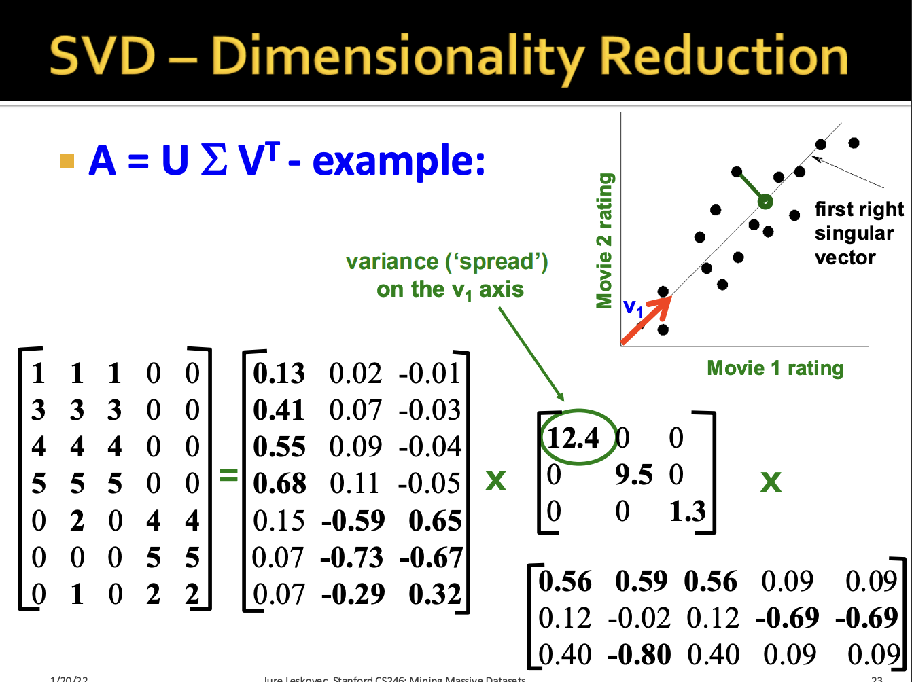
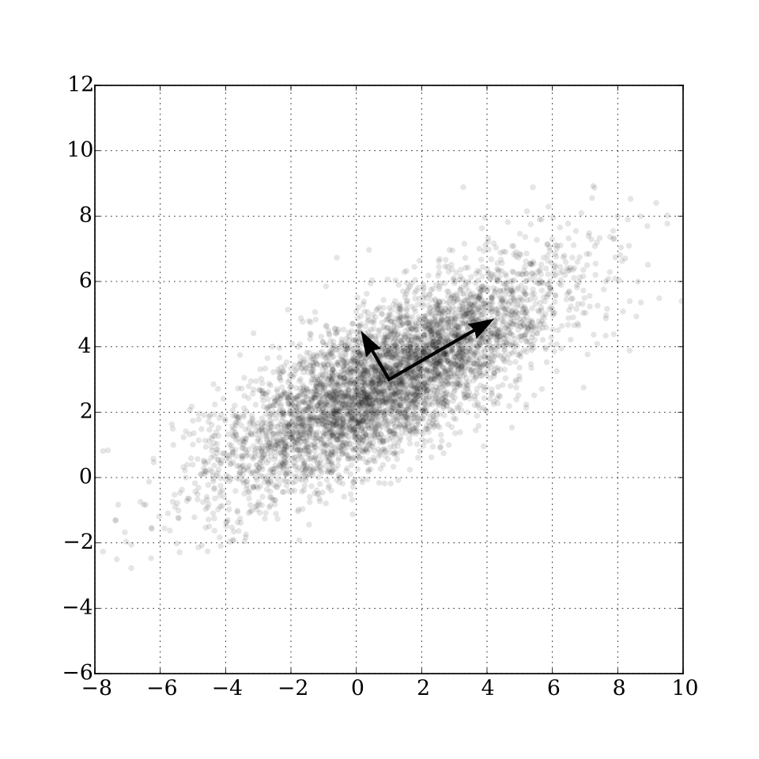

# Dimensionality Reduction

> Talk about PCA vs SVD and the mathematical similarities (eigendecomposition). Show the relevant math. Also show a practical example where we want to de-correlate features for regression.

## First Principles: Understanding Some Underlying Math

### Spectral Decomposition

Consider a real square matrix $A \in \mathbb{R}^{n\times n}$ such that $A = A^T$. Then decompose $A = Q \Lambda Q^T$ where the columns of $Q$ are orthonormal eigenvectors and $\Lambda$ is a diagonal matrix of the eigenvalues.

### Singular Value Decomposition

Let our input matrix $A\in \mathbb{R}^{m\times n}$ be $A\approx U\Sigma V^T$ where $U$ containes left singular vectors $\in\mathbb{R}^{m\times r}$, $\Sigma\in\mathbb{R}^{r\times r}$ contains singular values, and $V\in\mathbb{R}^{n\times r}$ contains right singular vectors. $U, V$ are column orthonormal, so $U^TU = V^TV= I$, and $\sigma_1 \geq \sigma_2\geq \cdots \geq 0$.

This is the full SVD. A low-rank approximation can be obtained via $A\approx \sum_i \sigma_i u_i \cdot v_i^T$: think of this as a sum of each out-product of the embeddings in each dimension.

The SVD can project a dataset $A$ in each of its "concepts," with $\sigma_1$ being the strongest concept. This becomes a useful trick for dimensionality reduction.

[Credit: Stanford CS 246. This slide is a great visualization!]

## SVD Relation to Spectral Decomposition

We use power iteration to find the eigenpairs for $A$ to get its SVD.

Suppose $A = U\Sigma V^T$, then $A^TA = V\Sigma U^TU \Sigma V^T = V \Sigma^2 V^T$ and $A^TAV = V\Sigma^2$.

> If we solve for the eigenpairs of $A^TA$, then we find $V$ and $\Sigma$ since $A^TAV = V\Sigma^2$. We do the equivalent for $AA^T$ to find $U$.

> Question: can you derive the relation to the singular values and eigenvalues?

__PCA is similar. Given data X:__

1. Center data
2. Compute covariance matrix
3. Perform eigen-decomposition

> $\Sigma = \frac{1}{n} X^TX$, then $\Sigma = Q\Lambda Q^T$. All of the principal components are $Z = XQ$ and choose however many of the top PCs you want (i.e. how many components of variants would you like to use to express your data.)

