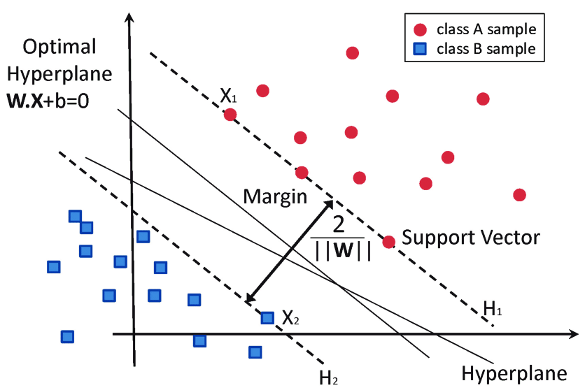
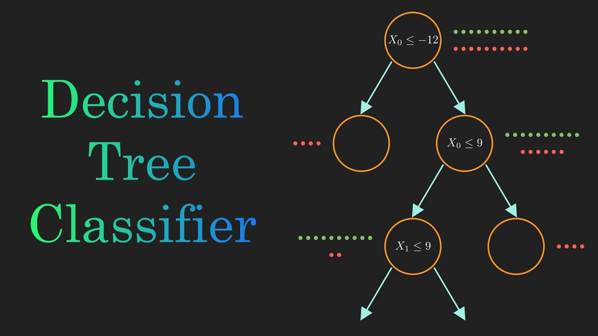
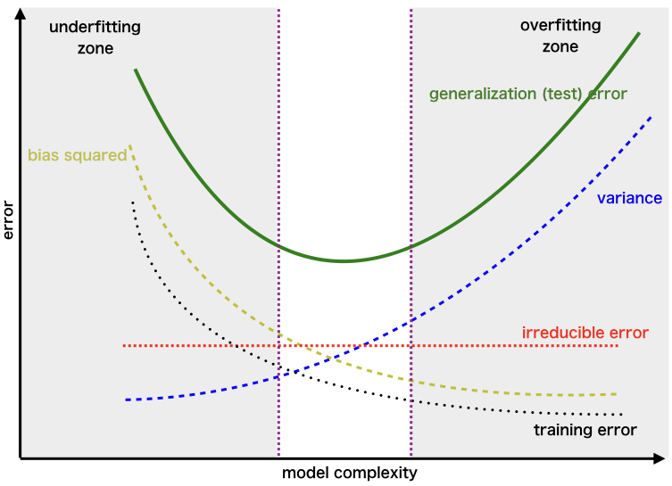
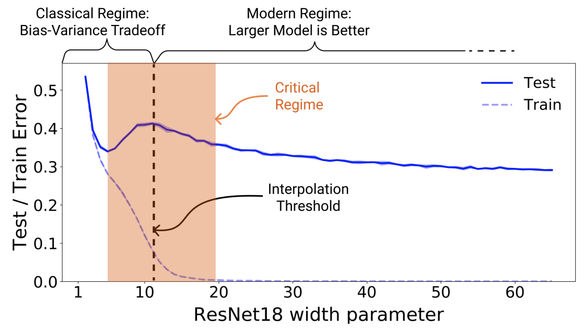

# To SVMs and Beyond!

> The other half of intro ML content (SVMs, decision trees, boosting, bagging, bias-variance, maybe ERM as well).

## SVMs (with Kernels)

The kernel trick is one of the coolest things I learned about in my first ML course.

SVMs allow for generating a bex-approximation hyperplane for $\sim$ linearly-separable data. It's an optimization problem

$$min_{w,b} w^Tw$$
$$\text{s.t. } \forall i, y_i(w^Tx_i + b) \ge 1$$

With soft constraints this is

$$min_{w,b} w^Tw + C\sum_{i=1}^n \xi_i$$
$$\text{s.t. } \forall i, y_i(w^Tx_i + b) \ge 1 - \xi_i$$
$$\forall i, \xi_i \ge 0$$

When $C$ is high, the penalty is high for misclassification, so the boundary is small. When $C$ is low, the boundary is wide and makes some misclassifications. Intuitively, SVM finds the hyperplane that maximizes the margin between classes while penalizing violations.

Only some points actually determine the boundary. These are the **support vectors**, the points closest to the decision boundary.

The optimization problem can be rewritten in its dual form:

$$
\max_\alpha \sum_{i=1}^n \alpha_i - \frac{1}{2}\sum_{i,j}\alpha_i\alpha_j y_i y_j x_i^Tx_j
$$

$$
\text{s.t. } 0 \le \alpha_i \le C, \quad \sum_{i=1}^n \alpha_i y_i = 0
$$

The classifier becomes

$$
f(x) = \sum_{i=1}^n \alpha_i y_i x_i^T x + b
$$

Notice that the data only appears through **dot products** $x_i^T x_j$.

This is where the **kernel trick** comes in. Instead of computing the dot product in the original space, we replace it with a kernel function

$$
K(x_i, x_j) = \phi(x_i)^T \phi(x_j)
$$

which corresponds to mapping the data into a higher-dimensional feature space $\phi(x)$.

The classifier becomes

$$
f(x) = \sum_{i=1}^n \alpha_i y_i K(x_i, x) + b
$$

Common kernels include

- Polynomial: $K(x,z) = (x^T z + c)^d$
- RBF / Gaussian: $K(x,z) = e^{-\gamma\|x-z\|^2}$
- Sigmoid: $K(x,z) = \tanh(ax^Tz + c)$

This allows SVMs to learn **nonlinear decision boundaries** without explicitly computing the high-dimensional feature mapping.

The dataset above can simply have a kernel $\phi(x) : \mathbb{R}^2 \rightarrow \mathbb{R^3}$ where $\phi([x_1, x_2]) = [x_1, x_2, x_1^2 + x_2^2]$. What this does is factors in the datapoint's distance from 0: thus, the blue points and red points can easily be split by this third basis. Adding the third feature which is the radius allows for easy splitting.

A kernel feature map can include all pairwise (or higher-order) interactions between features. For example, a polynomial expansion may contain terms such as $x_i x_j$, $x_i^2 x_j$, and other higher-degree combinations. Explicitly constructing these features quickly becomes computationally expensive as the dimensionality grows.

Instead, we introduce kernel functions that compute inner products in the higher-dimensional feature space directly:

$$
K(x,z) = \phi(x)^T \phi(z)
$$

This allows SVMs to operate as if the data were mapped into a very high-dimensional (or even infinite-dimensional) feature space without explicitly computing the feature map $\phi(x)$. This technique is known as the **kernel trick**.

## Decision Trees

Decision trees are one of the most powerful classical ML options (especially for Kaggle). They can work with classification or regression (adding a regression head on top of leaf nodes).

This is like 20 questions! Except there are some more advanced tactics to decide how to split our data. Entropy is the most common approach. One common approach is **entropy**.

Entropy measures the impurity of a node:

$$
H(S) = -\sum_{c} p_c \log_2 p_c
$$

where $p_c$ is the proportion of class $c$ in the dataset.

When all examples belong to one class, entropy is $0$ (pure node). When classes are evenly mixed, entropy is highest.

When splitting the data on feature $A$, we compute the **information gain**:

$$
IG(S, A) = H(S) - \sum_v \frac{|S_v|}{|S|} H(S_v)
$$

where $S_v$ is the subset of data with feature value $v$.

The decision tree chooses the split that **maximizes information gain**, meaning it reduces entropy the most.

## Bias-Variance Tradeoff

This is one of the most important ideas throughout ML into deep learning.

- **Bias** measures how much a model’s predictions systematically deviate from the true relationship. High bias models are too simple and underfit the data.
- **Variance** measures how sensitive a model is to changes in the training data. High variance models fit the training data very closely but may not generalize well.

> **Overfitting** occurs when training error is very low but test error is high, meaning the model has memorized the training data and does not generalize well.

> **Underfitting** occurs when both training and test error are high, meaning the model is too simple to capture the underlying structure of the data.

Complex models are high variance: they fit datasets very well but generalize poorly. Simple models (like using linear regression on a task that is more advanced and requires decision trees) have high bias: think bias to the assumptions in data.

The beginning looks like standard ML with an overfitting region. However, eventually models get so big and good that they no longer overfit and larger is better.

## Boosting and Bagging

Tree ensembles help manage the **bias–variance tradeoff**. Decision trees tend to have **low bias but high variance**, meaning they fit data well but are unstable. Ensemble methods combine many trees to improve performance.

Generally, more complex models begin overfitting (high variance), however for deep learning a scenario known as **deep double descent** occurs.

### Bagging

**Bagging (Bootstrap Aggregating)** reduces **variance** by training many trees independently.

1. Sample training data **with replacement** (bootstrap samples).
2. Train a tree on each sample.
3. Average predictions (regression) or take a majority vote (classification).

If we train $B$ trees $f_1,\dots,f_B$:

$$
\hat{f}(x) = \frac{1}{B}\sum_{b=1}^B f_b(x)
$$

**Random Forest** improves bagging by also sampling a **random subset of features** at each split, which decorrelates the trees.

### Boosting

**Boosting** builds trees **sequentially**, with each new tree correcting the errors of the previous ones. This primarily reduces **bias**.

The model becomes a weighted sum of weak learners:

$$
F(x) = \sum_{m=1}^{M} \alpha_m f_m(x)
$$

In **gradient boosting (e.g., XGBoost)**, each new tree fits the **residual errors** of the current model.

**Summary**

- **Bagging / Random Forest** → independent trees, averaged → reduces variance
- **Boosting / XGBoost** → sequential trees correcting errors → reduces bias
