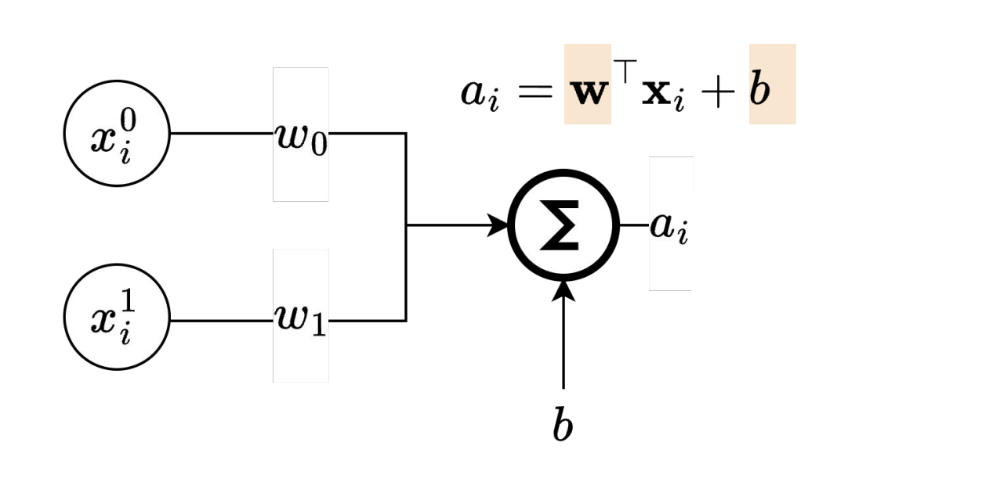
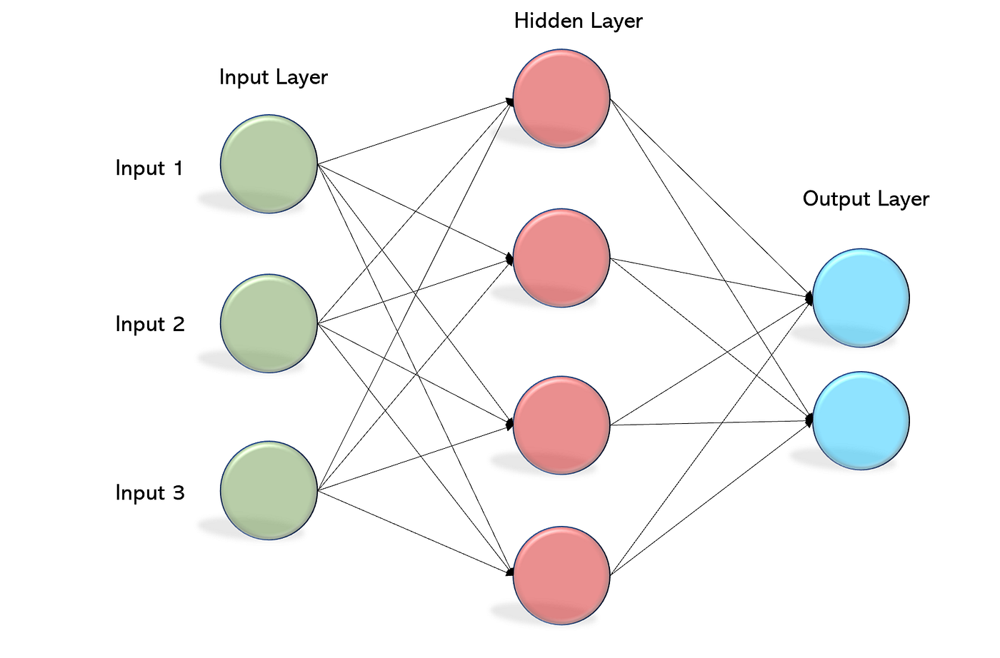
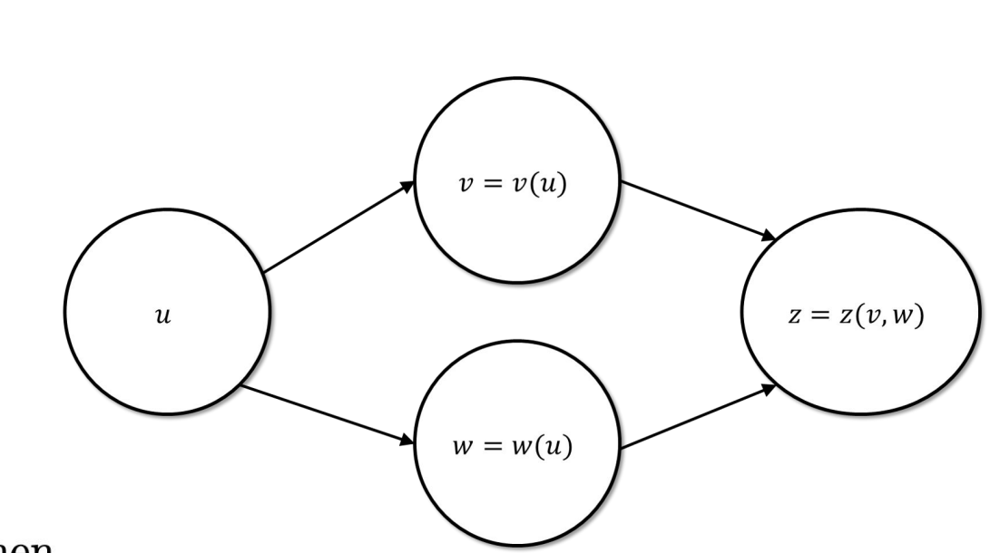
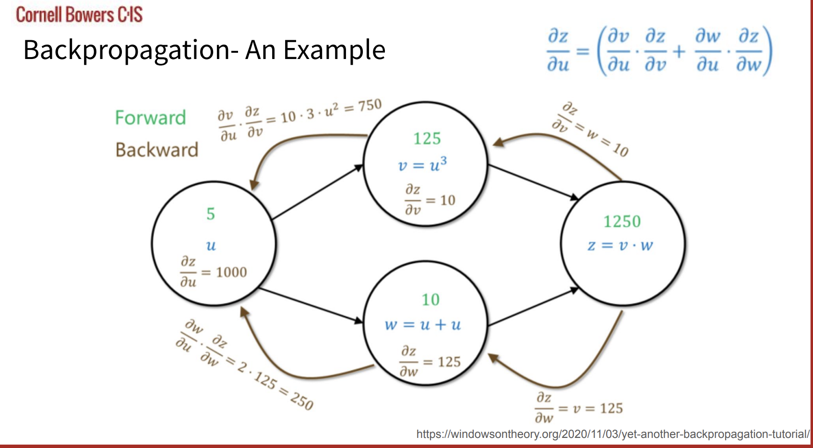

# Backpropagation: Making Deep Learning Possible

To understand backpropagation, we must first understand the simple structure of a neural network.

First consider a single perceptron:

our inputs $x_i$'s are multiplied by respective weights $w_i$'s and the actual neuron aggregates these incoming signals to produce an output. The simplest form is a sum aggregation. If the sum of all these incoming signals $x_i^T w > \tau$, some threshold, then the activation $a_i$ fires. We can also add in a bias $b$ to the neuron.

This will produce a simple step-function activation. But notice a step function is not differentiable (this will be a problem when constructing our learnable algorithm).

As a general form, the output of a neuron is $$\hat{y}_i = \sigma(w^Tx_i + b)$$ for some non-linearity $\sigma$. 

> Note, here say $x_i\in \mathbb{R}^d$, then $w\in \mathbb{R}^d$ s another weight vector. This is for a single neuron. If we have multiple neurons in a layer ($k$), then $x\in \mathbb{R}^d$ and $W\in \mathbb{R}^{k\times d}$ to represent weights for each neuron. This produces an output $y\in \mathbb{R}^k$ at some layer.

Common non-linearties are

$$ReLU(x) = max(0, x) \text{ [not differentiable at 0]}$$
$$\sigma(z) = \frac{1}{1 + e^{-z}}$$
$$\sigma(z) = \frac{1}{1 + e^{-z}} \text{ [differentiable and between 0 and 1]}$$
$$tanh(x) = \frac{e^x - e^{-x}}{e^x + e^{-x}} \text{ [differentiable and between -1 and 1]}$$
$$LeakyReLU(x) = max(\alpha x, x) \text{ [common in current neural networks]}$$

Just to name a few...

> MLPs are incredibly expressive as shown form the Universal Approximation Theorem. In short, a single hidden-layer MLP with arbitrary width can be a universal function approximator. Here is one such example:

> Depth vs width. A wide MLP can express any comlpex boundary. Depth allows an MLP to represent complex functions much more efficiently, often requiring exponentially fewer neurons than a shallow network.

## The important advance

So we can pick some weights in a weight matrix $W$, but what if we want to learn these from experience?

Say our network produces some labels $\hat{y}$ for a training example $x$ and we know the actual target value should be $y$. Assume we are regressive $y$ on our input features and we want to get the mean squared error low. How do we update our weights $W$? This is what the backpropagation algorithm allows us to do.

## Problem setup

Our MLP produces output $\hat{y}$ for label $x$, but the true prediction is $y$. We can measure the loss $\mathcal{L}(y, \hat{y}) = MSE(y, \hat{y}) = \frac{1}{n}\sum_{i=1}^n (y_i - \hat{y{_i}})^2$.

Our goal is to minimize this loss over the entire training dataset $D_{TR} = \{x_i, y_i\}_{i=0}^n$. In other words, we want

$$\min_w \mathcal{L}(D_{TR}; w) = \frac{1}{n}\sum_{i=1}^n \ell(\sigma(w^Tx_i), y_i)$$

assuming the output is $\sigma(w^Tx_i)$ and our MLP is parameterized by $w$.

## The intuition

This just requires the chain rule:

$$\frac{dz}{dx} = \frac{dz}{dy} \frac{dy}{dx}$$

For the multivariate chain rule, if $f(u)$ is $z = f(v(u), w(u))$, then

$$\frac{df}{du} = (\frac{dv}{du} \frac{dz}{du} + \frac{dw}{du} \frac{dz}{dw})$$

Here's an example of what backprop looks like through a simple network (courtesy of CS 4782)

We first call the forward pass through the network: if $u=5$, then $v=125$, $w = 10$, and $z = 1250$.

Now we can call the backwards function through our network: with the chain rule we find all the gradients above through every node. Starting with $z$, if we know the gradients at each step and move these backwards through the network, we can ultimately find $\frac{dz}{du}$.

## Algorithms

### Forward Pass Through an MLP

**Input:**  
- input vector $x$  
- weight matrices $W^{[1]}, \dots, W^{[L]}$ 
- bias vectors $b^{[1]}, \dots, b^{[L]}$

**Algorithm**

1. Initialize input  
   $$
   z^{[0]} = x
   $$

2. For $l = 1$ to $L$:

   **Linear transformation**
   $$
   a^{[l]} = W^{[l]} z^{[l-1]} + b^{[l]}
   $$

   **Nonlinear activation**
   $$
   z^{[l]} = \sigma^{[l]}(a^{[l]})
   $$

3. End for

**Output**

$$
z^{[L]}
$$

---

### Backward Pass Through an MLP (Backpropagation)

**Input:**  
- activations $z^{[1]}, \dots, z^{[L]}$
- pre-activations $a^{[1]}, \dots, a^{[L]}$
- loss gradient $\frac{\partial \mathcal{L}}{\partial z^{[L]}}$

### 1. Compute output layer error

$$
\delta^{[L]} =
\frac{\partial \mathcal{L}}{\partial a^{[L]}}
=
\frac{\partial \mathcal{L}}{\partial z^{[L]}}
\odot
\sigma^{[L]'}(a^{[L]})
$$

---

### 2. Backpropagate through layers

For $l = L$ down to $1$:

**Gradient of weights**

$$
\frac{\partial \mathcal{L}}{\partial W^{[l]}}
=
\delta^{[l]} (z^{[l-1]})^T
$$

**Gradient of biases**

$$
\frac{\partial \mathcal{L}}{\partial b^{[l]}}
=
\delta^{[l]}
$$

**Gradient w.r.t. previous activation**

$$
\frac{\partial \mathcal{L}}{\partial z^{[l-1]}}
=
(W^{[l]})^T \delta^{[l]}
$$

**Compute previous layer error**

$$
\delta^{[l-1]}
=
((W^{[l]})^T \delta^{[l]})
\odot
\sigma^{[l-1]'}(a^{[l-1]})
$$

**Output**

Gradients for all parameters:

$$
\frac{\partial \mathcal{L}}{\partial W^{[1:L]}}
\quad
\frac{\partial \mathcal{L}}{\partial b^{[1:L]}}
$$

## What's the point?

Now that we have gradients for each parameter, we can use gradient descent to step these weights in the direction which will minimize loss. At each layer, for each weight, we can adjust these parameters to make our predictions more accurate for our MLP, thus allowing it to "learn."