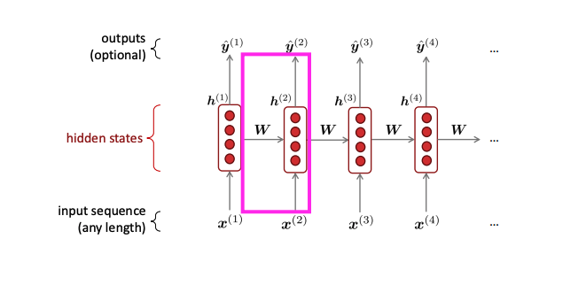
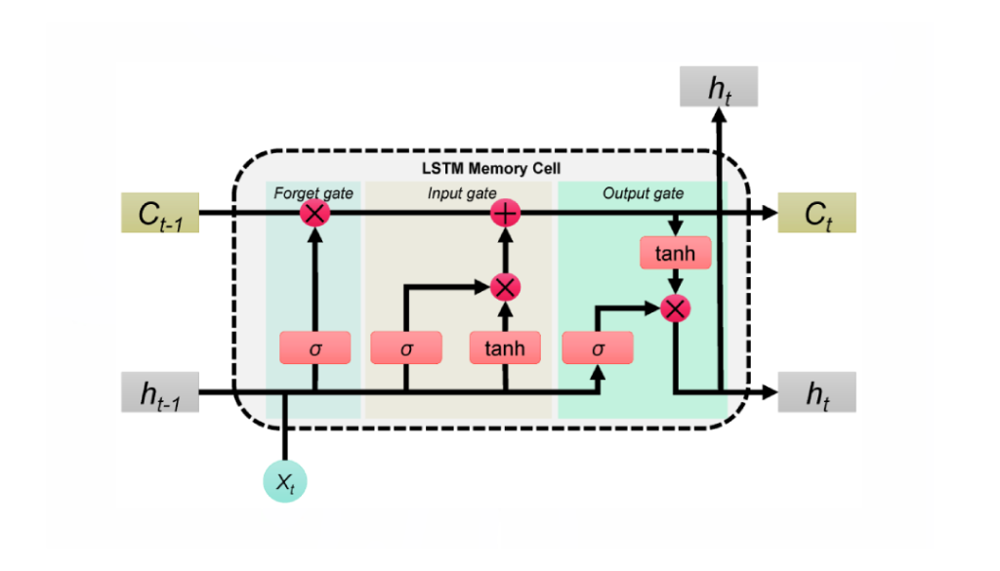

# Recurrent Neural Networks

> Before there were transformers,this was the state of the art.

What is the core objective in language modeling?

$$P(x_T \mid x_1, x_2, \cdots, x_{T-1})$$

In other words, just next-token prediction. We can use our trusty tool (the chain rule of probability) to just find the probability of an entire sequence of tokens existing:

$$P(X_T, \cdots, x_2, x_1) = P(X_1) P(X_2\mid X_1) \cdots P(X_T\mid X_{T-1}\cdots X_1)$$
$$=\prod_{t=1}^T P(X_t\mid x_{t-1} \cdots x_1)$$
which is exactly what an LLM does in an autoregressive sense.

## N-Gram Model

Make the Markov assumption that $x_{t+1}$ depends on the previous $n-1$ words (this is like semi-Markovian):

San $N=3$ (common max for these models) find $P(x_{t+1}\mid x_{t}, x_{t-1})$ for all tokens $x$ in our vocabulary. Predict the one that has the highest likelihood.

This is easy to compute: $P(x_{t+1}\mid x_{t}, x_{t-1}) = \frac{count(x_{t+1}, x_{t}, x_{t-1})}{count(x_{t}, x_{t-1})}$

There are lots of problems:
- The storage required is __huge__ to get all of these possible $n$ grams in the corpus
- Corpuses need to be huge and to a certain extent do not scale well
- This model breaks with unseen tokens
- This doesn't leverage word embeddings, so let's look at a new approach

## RNNs

__Core idea__: apply the same weoghts $W$ repeatedly to a network

Output $\hat{y}^{(t)} = softmax(Uh^{(t)} + b_2)$

Hidden state $h^{(t)} = \sigma(W_hh^{(t-1)} + W_ee^{(t)} + b_1)$

Word embeddings $e^{(t)} = Ex^{(t)}$, and words are 1-hot vectors.

Advantages:
- Can process any length input
- Model size is same for large inputs
- Shared weights

Disadvantages:
- Computation can be slow
- Gradients from far away timesteps minimally influence earlier timesteps: vanishing/exploding gradients (i.e. temporal relations are not always fully sequential)

> We need something to fix these issues. LSTMs are RNNs that incorporate remember and forget gates to leverage long and short-term memory...

## LSTMs (Long Short-Term Memory)

__Core idea__: introduce a memory cell with gates that control information flow, allowing the model to preserve information over long time horizons.

LSTMs maintain:

- hidden state $h^{(t)}$  
- cell state $c^{(t)}$

---

### Gates

Forget gate:

$$
f^{(t)} =
\sigma\left(W_f [h^{(t-1)}, e^{(t)}] + b_f\right)
$$

Input gate:

$$
i^{(t)} =
\sigma\left(W_i [h^{(t-1)}, e^{(t)}] + b_i\right)
$$

Candidate memory:

$$
\tilde{c}^{(t)} =
\tanh\left(W_c [h^{(t-1)}, e^{(t)}] + b_c\right)
$$

There are different sets of shared weights for each of these gates. They each learn different properties like forget, remember, etc.

---

### Cell update (key equation)

$$
c^{(t)} =
f^{(t)} \odot c^{(t-1)}
+
i^{(t)} \odot \tilde{c}^{(t)}
$$

This additive update allows gradients to flow more easily through time, helping prevent vanishing gradients.

---

### Output

Output gate:

$$
o^{(t)} =
\sigma\left(W_o [h^{(t-1)}, e^{(t)}] + b_o\right)
$$

Hidden state:

$$
h^{(t)} =
o^{(t)} \odot
\tanh(c^{(t)})
$$

>Vanilla RNNs repeatedly multiply by weight matrices, causing gradients to shrink or grow exponentially.

>LSTMs introduce gated, additive memory updates that stabilize training and enable learning long-range dependencies.