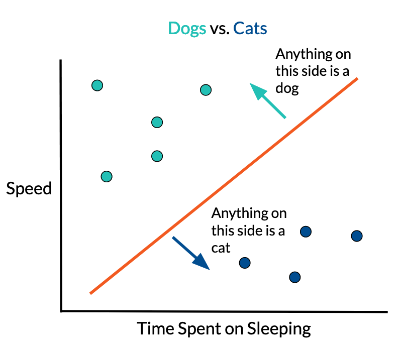
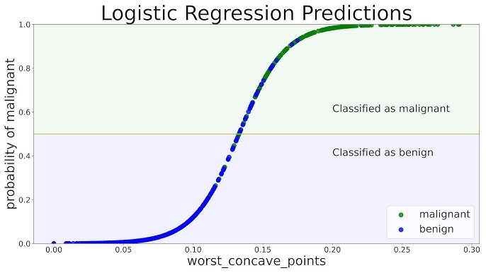
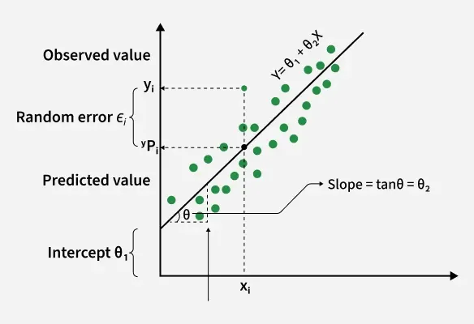
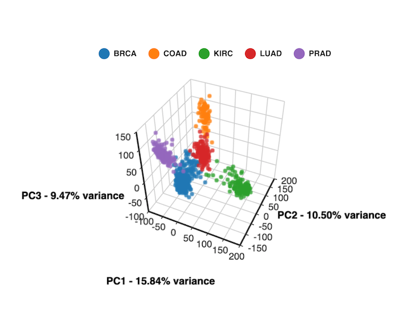
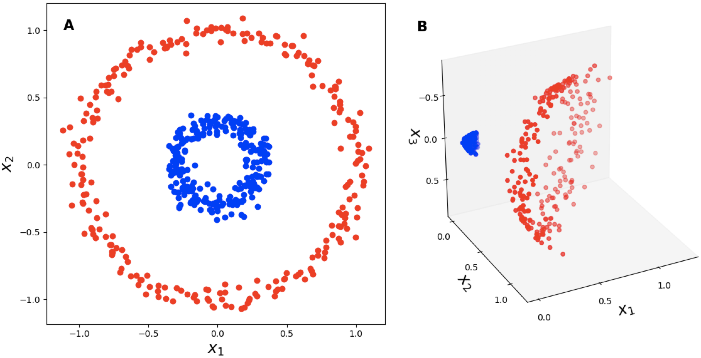

# The First ML Algorithms

## Perceptron: Some Brief History

Frank Rosenblatt's perveptron was a crucial building block to the first trainable artificial neural network. This is one of the first algorithms which learns from data.

_Assumptions:_ data is linearly separable. Otherwise the algorithm runs forever.

> ## Perceptron Algorithm
>
> Given training data $\{(x_i, y_i)\}_{i=1}^n$ where $x_i \in \mathbb{R}^d$ and $y_i \in \{-1, +1\}$:
>
> 1. Initialize:
>    - $w \leftarrow 0$
>    - $b \leftarrow 0$
> 2. Repeat until convergence or for a fixed number of epochs:
>    - For each training example $(x_i, y_i)$:
>      - If
>        $$
>        y_i (w^\top x_i + b) \le 0
>        $$
>        then update:
>        $$
>        w \leftarrow w + y_i x_i
>        $$
>        $$
>        b \leftarrow b + y_i
>        $$
> 3. Output:
>    - Final weight vector $w$
>    - Final bias $b$
>
> ### Prediction Rule
>
> For a new input $x$:
>
> $$
> \hat{y} = \mathrm{sign}(w^\top x + b)
> $$

The key is we update our hyperplane parameters $w$ whenever a point is misclassified.

## K-Means and Clustering

Clustering is a primary form of **unsupervised learning**; this algorithm finds clusters on its own (if you specify how many centers you want).

> ## K-Means Algorithm
>
> Given a dataset $\{x_1, x_2, \dots, x_n\}$ and a chosen number of clusters $k$:
>
> 1. Initialize:
>    - Randomly choose $k$ points as initial centroids  
>      $c_1, c_2, \dots, c_k$
> 2. Repeat until convergence:
>
>    **Assignment step**
>    - For each data point $x_i$, assign it to the nearest centroid:
>      $$
>      \text{cluster}(x_i) = \arg\min_j \|x_i - c_j\|^2
>      $$
>
>    **Update step**
>    - Recompute each centroid as the mean of the points assigned to it:
>      $$
>      c_j = \frac{1}{|C_j|} \sum_{x_i \in C_j} x_i
>      $$
>
> 3. Output:
>    - Final cluster assignments
>    - Final centroids $c_1, \dots, c_k$

## Naive Bayes and Logistic Regression

Naive Bayes hinges on a single assumption: conditional independence. Say you want to predict whether a child likes ice cream or not, so $y=1$ if a child likes ice cream and 0 otherwise. There are many features for a child: $height$, $age$, $likes\_sports$, $likes\_cookies$ just to name a few. The feature vector is $X$ of length $n$. Then, $$P(y\mid X) := P(\text{likes ice cream}\mid height, age, likes\_sports, likes\_cookies)$$
Instead of doing a more sophisticated classification (or logistic regression) on all of these features, assume conditional independence: $P(X\mid y) = P(x_1 \mid y)P(x_2 \mid y)...P(x_n \mid y)$. This assumption that feature values are independent given labels is very strong. We can use Bayes rule

$$P(y\mid x) = \frac{P(x\mid y)P(y)}{P(x)}$$

to estimate these features. This has Bayes in the name, but it is actually a frequentist approach: it predicts purely on data without any priors. We can add a Laplace prior to the denominator. Say we have some initial assumption that roughly 50% of kids like ice cream, then add some Laplace smoothing factor and use the formal Naive Bayes expression:

$$
[\theta_{jc}]_{\alpha} = \frac{N_{jc} + \alpha}{N_c + \alpha |V|}
$$

where

- $N_{jc}$ is the number of times feature $j$ appears in class $c$
- $N_c$ is the total number of feature occurrences in class $c$
- $K$ is the number of possible feature values
- $\alpha$ is the Laplace smoothing parameter
- $|V|$ is the total vocab size ($\alpha K$ may also be a good smoothing factor)

### Logistic Regression is a generative counterpart to Naive Bayes

Naive Bayes is generative because it models $P(x_i \mid y)$ and makes direct assumptions about the distribution of data. Logistic regression is discriminative because we model $P(y\mid x_i)$ directly.

$$P(y\mid x_i) = \frac{1}{1 + e^{-y(w^Tx_i + b)}} = \sigma(y(w^Tx_i + b))$$

We ultimately get a sigmoid curve 
where above some threshold (say 0.5) we classify a point as $+$.

To actually find this optimal sigmoid, we need to learn the parameters for $w$: this utilizes gradient descent over some loss (will cover in next section about optimization). We need to find the gradient to optimize over. One approach is MLE:

$$\hat{w}_{MLE} = argmax_w P(D\mid w) = argmax_w P((y_1, x_1), ..., (y_n, x_n) \mid w) $$

$$= argmax_w \Pi_{i=1}^n P((y_i, x_i)\mid w) \text{ (since data is iid)}$$

$$= argmax_w \Pi_{i=1}^n P(y_i\mid x_i, w) P(x_i\mid w) \text{ (chain rule of statistics)}$$

$$= argmax_w \Pi_{i=1}^n P(y_i\mid x_i, w) P(x_i) \text{ ($x_i$ does not depend on $w$)}$$

$$= argmax_w \sum_{i=1}^n \log(P(y_i\mid x_i, w)) \text{ (log trick)}$$

$$= argmax_w - \sum_{i=1}^n \log(1 + e^{-y_iw^Tx_i}) \text{ (substitute and collapse $+b$ into features)}$$

$$= argmin_w \sum_{i=1}^n \log(1 + e^{-y_iw^Tx_i}) \text{ (minimize instead)}$$

This is our minimization objective. For each batch in our training data, we compute the gradient of this expression and take a step in this direction to maximize the likelihood of this observed data.

## Linear Regression

Logistic regression used MLE: for linear regression I will show the MLE and MAP approaches and explain the closed-form solution for OLS regression.

Data assumption: $y_i\in \mathbb{R}$. Model assumption: $y_i = w^Tx_i + \epsilon_i$ where $\epsilon_i \sim N(0, \sigma^2)$. Our data is a line plus some normal mean 0 noise.

With MLE:
$$\hat{w}_{MLE} = argmax_w P(D\mid w) = \Pi_{i=1}^n P((y_i, x_i)\mid w)$$

$$= argmax_w \Pi_{i=1}^n P(y_i\mid x_i, w) P(x_i\mid w) = argmax_w \Pi_{i=1}^n P(y_i\mid x_i, w) P(x_i)$$

$$= argmax_w \Pi_{i=1}^n P(y_i\mid x_i, w) \text{ (can drop the constant $x_i$)}$$

$$= argmax_w \sum_{i=1}^n \log[P(y_i\mid x_i, w)] \text{ (log trick (monotonic))}$$

$$= argmax_w \sum_{i=1}^n [\log\left(\frac{1}{\sqrt{2\pi\sigma^2}}\right) + \log\left(e^\frac{-(x_i^Tw - y_i)^2}{2\sigma^2}\right)] \text{ (plug in probability distribution)}$$

$$= argmax_w - \frac{1}{2\sigma^2} \sum_{i=1}^n(x_i^Tw - y_i)^2 = argmin_w \frac{1}{n} \sum_{i=1}^n (x_i^Tw - y_i)^2$$

... all this work was just to reproduce mean squared error. This leads to standard OLS (ordinary least squares) regression. This is all linear regression is: update $w$ to minimize some MSE between our predictions $x_i^Tw$ and the true value $y_i$.

The MAP approach adds a regularization term $\lambda \|w\|_2^2$ which is RIdge Regression. L2 (ridge) regression uses a 2-norm, and L1 (lasso) uses an absolute value to perform feature selection and promote sparse solutions. There is more advanced numerical analysis to justify this (I can add at a later date). Regularizers are very important to prevent overfitting and do feature selection.

Closed-form OLS: objective is to minimize $\sum_{i=1}^n (x_i^T w - y_i)^2$.

$$\hat{w} = argmax_w \sum_{i=1}^n (x_i^T w - y_i)^2$$
$$= argmax_w \sum_{i=1}^n (x_i^Tw)^T(x_i^T w) - 2y_i x_i^Tw + y_i^Ty_i$$
$$= argmax_w \sum_{i=1}^n w^Tx_ix_i^T w - 2y_i x_i^Tw + y_i^Ty_i$$

Taking the derivative WRT $w$...

$$0 = \sum_{i=1}^n w^T x_i x_i^T - 2y_ix_i^T =$$

$$\sum_{i=1}^n 2y_ix_i^T = \sum_{i=1}^n w^T x_i x_i^T$$

The sum of squared residuals is $(Xw - y)^2$, which is what we want to minimize

$$\hat{w} = argmin_w (Xw - y)^2$$
$$\hat{w} = argmin_w (Xw - y)^T (Xw - y)$$
$$\hat{w} = argmin_w (Xw)^T (Xw) - 2y^TXw + y^Ty$$
$$\hat{w} = argmin_w w^TX^TXw - 2y^TXw + y^Ty$$

Taking the derivative WRT $w$...

$$0 = w2^TX^TX - 2X^Ty$$

$$w^TX^TX = X^Ty \implies w^T = (X^TX)^{-1} X^Ty$$

## PCA

Linear regression can be very powerful, but what happens when there are correlations in many dimensions, or what if only a few features are really important? This is a common issue where high dimensional data lives in a lower-dimensional subspace. For instance, most of the variance happens in a dingle dimension.

Principle component analysis allows us to project data from a high dimensional space onto its high-variance dimensions. This uses a spectral decomposition.

> First, center data to mean 0: $\hat{x}_i = x_i - \mu$ to omit the complication of the data's mean.

> The first principle component of a data set $\{x_i\}_{i=1}^n$ is a vector $\phi\in \mathbb{R}^d$ which solves $$max_{\|\phi\|_2 = 1} \frac{1}{n} \sum_{i=1}^n (\phi^T\hat{x}_i)^2$$

Another common approach is to use SVD. Any $m\times n$ matric can be broken down into $U\Sigma V^T$ where $U$ has orthonormal columns (left singular vectors), $\Sigma$ is the singular value matrix and $V^T$ is the transpose of an orthogonal matric containing right single vectors. You can keep the top $k$ singular values and their corresponding vectors and this provides a low-rank approximation for the original data. This is kind of similar to a PCA-style technique.

In PCA, we instead consider the covariance matrix

$$
\Sigma_X = \frac{1}{n}X^T X
$$

and compute its eigendecomposition

$$
\Sigma_X = V \Lambda V^T
$$

where the eigenvectors $V$ correspond to the principal directions and the eigenvalues $\Lambda$ represent the variance captured along those directions.

Now observe that if we compute the SVD of the centered data matrix

$$
X = U\Sigma V^T
$$

then

$$
X^T X = V \Sigma^2 V^T
$$

Thus the **right singular vectors $V$ are exactly the principal components**, and the **squared singular values correspond to the eigenvalues of the covariance matrix**.

Therefore PCA can be computed simply by performing SVD on the centered data matrix and taking the first $k$ columns of $V$. These directions capture the maximum variance in the data and provide a low-dimensional representation.

**PCA does not require explicit computation of the covariance matrix. Just the SVD of the centered data captures the maximal variance components.**

## SVMs (with Kernels)

The kernel trick is one of the coolest things I learned about in my first ML course.

SVMs allow for generating a bex-approximation hyperplane for $\sim$ linearly-separable data. It's an optimization problem

$$min_{w,b} w^Tw$$
$$\text{s.t. } \forall i, y_i(w^Tx_i + b) \ge 1$$

With soft constraints this is

$$min_{w,b} w^Tw + C\sum_{i=1}^n \xi_i$$
$$\text{s.t. } \forall i, y_i(w^Tx_i + b) \ge 1 - \xi_i$$
$$\forall i, \xi_i \ge 0$$

When $C$ is high, the penalty is high for misclassification, so the boundary is small. When $C$ is low, the boundary is wide and makes some misclassifications. Intuitively, SVM finds the hyperplane that maximizes the margin between classes while penalizing violations.

Only some points actually determine the boundary. These are the **support vectors**, the points closest to the decision boundary.

The optimization problem can be rewritten in its dual form:

$$
\max_\alpha \sum_{i=1}^n \alpha_i - \frac{1}{2}\sum_{i,j}\alpha_i\alpha_j y_i y_j x_i^Tx_j
$$

$$
\text{s.t. } 0 \le \alpha_i \le C, \quad \sum_{i=1}^n \alpha_i y_i = 0
$$

The classifier becomes

$$
f(x) = \sum_{i=1}^n \alpha_i y_i x_i^T x + b
$$

Notice that the data only appears through **dot products** $x_i^T x_j$.

This is where the **kernel trick** comes in. Instead of computing the dot product in the original space, we replace it with a kernel function

$$
K(x_i, x_j) = \phi(x_i)^T \phi(x_j)
$$

which corresponds to mapping the data into a higher-dimensional feature space $\phi(x)$.

The classifier becomes

$$
f(x) = \sum_{i=1}^n \alpha_i y_i K(x_i, x) + b
$$

Common kernels include

- Polynomial: $K(x,z) = (x^T z + c)^d$
- RBF / Gaussian: $K(x,z) = e^{-\gamma\|x-z\|^2}$
- Sigmoid: $K(x,z) = \tanh(ax^Tz + c)$

This allows SVMs to learn **nonlinear decision boundaries** without explicitly computing the high-dimensional feature mapping.

The dataset above can simply have a kernel $\phi(x) : \mathbb{R}^2 \rightarrow \mathbb{R^3}$ where $\phi([x_1, x_2]) = [x_1, x_2, x_1^2 + x_2^2]$. What this does is factors in the datapoint's distance from 0: thus, the blue points and red points can easily be split by this third basis. Adding the third feature which is the radius allows for easy splitting.

A kernel feature map can include all pairwise (or higher-order) interactions between features. For example, a polynomial expansion may contain terms such as $x_i x_j$, $x_i^2 x_j$, and other higher-degree combinations. Explicitly constructing these features quickly becomes computationally expensive as the dimensionality grows.

Instead, we introduce kernel functions that compute inner products in the higher-dimensional feature space directly:

$$
K(x,z) = \phi(x)^T \phi(z)
$$

This allows SVMs to operate as if the data were mapped into a very high-dimensional (or even infinite-dimensional) feature space without explicitly computing the feature map $\phi(x)$. This technique is known as the **kernel trick**.

## Decision Trees

## Bias-Variance Tradeoff

## Boosting and Bagging
